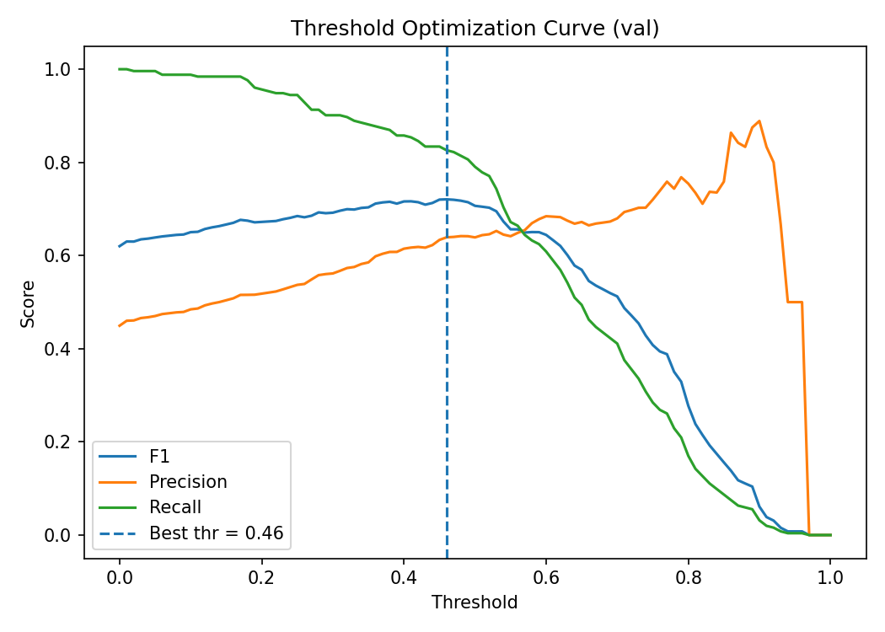
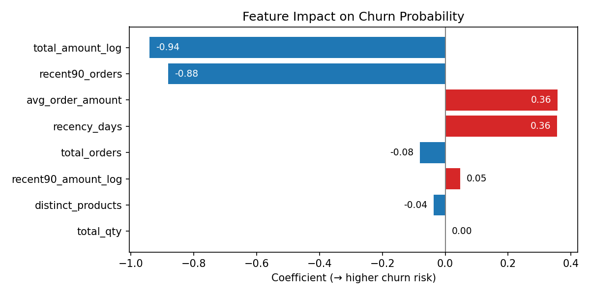

# Customer Retention Prediction with PySpark ML

> End-to-end churn prediction pipeline built with **PySpark, Spark MLlib, and FastAPI**, from raw transaction data (Online Retail II) to model serving.</br>The project demonstrates how customer-level behavioral features can be engineered, modeled, and served for retention optimization.

## Objective

To identify customers likely to churn based on their past purchasing behavior and transaction history, and to provide a scalable Spark-based framework for feature engineering, training, and inference.

## Dataset & Insights

**Source**: [Online Retail II (Kaggle)](https://www.kaggle.com/datasets/mashlyn/online-retail-ii-uci)

**Transactions**: 500k+ rows of invoice-level retail data

**Period**: 2009–2011

**Columns**: Invoice, StockCode, Description, Quantity, InvoiceDate, UnitPrice, CustomerID, Country

Customers were segmented into **three behavioral groups** — _active repeat, churned,_ and _new customers_ — based on purchase recency and frequency. These groups showed distinct spending and engagement patterns, forming a clear foundation for retention-focused modeling.

**Key preprocessing decisions:**

- Modeling focused only on existing customers with sufficient purchase history (≥2 orders or recent activity), while new customers were excluded due to lack of behavioral data for churn inference.

- Monetary features were log-transformed to mitigate extreme value skewness.

- Invalid transactions (returns or data errors) were removed.

- The variable measuring time gaps between consecutive purchases was excluded, as most customers either purchased once or within short intervals, providing minimal variance.

**Customer segments overview:**
| Segment | Customers | Avg. Orders | Avg. Monetary | Revenue Share |
| ------------- | --------- | ----------- | ------------- | ------------- |
| Active repeat | 3,007 | 10.1 | 5,045 | 85.5% |
| Churned | 2,402 | 2.8 | 1,240 | 13.5% |
| New customers | 472 | 1.0 | 378 | 1.0% |

> Active repeat customers account for over 85% of revenue, reinforcing the importance of retention strategies.

## Technical Overview

**Pipeline design:**

- **ETL (PySpark):** Cleaned data, applied log transformation, built customer-level aggregates (orders, quantity, amount, recency, etc.), and labeled churn using a cutoff and 180-day lookahead window.

- **Modeling (Spark MLlib):** Logistic Regression with imputation, feature scaling, and class-weight balancing in a single pipeline object (PipelineModel).

- **Evaluation:** Cross-validation with AUC-ROC / AUC-PR metrics, followed by threshold tuning (F1, recall, or precision) for operational decision optimization.

- **Serving:** A lightweight FastAPI service provides batch and single-customer prediction endpoints.

## Project Structure

```graphql
pyspark-retention-pipeline/
├── data/
│   ├── raw/                 # Original Kaggle CSV
│   ├── processed/           # Parquet feature tables and train/val/test splits
│   └── models/
│       └── latest_model/    # Trained Spark PipelineModel + metrics.json
│
├── docs/
│   ├── threshold_curve.png
│   ├── feature_importance.png
│
├── notebooks/
│   └── eda_online_retail.ipynb   # Exploratory data analysis and feature rationale
│
├── pipeline/
│   ├── etl.py               # Data cleaning, feature engineering, labeling
│   ├── train.py             # Model training + cross-validation
│   ├── eval.py              # Evaluation on test set
│   └── serve_api.py         # FastAPI inference service
│
├── Makefile
├── requirements.txt
├── .gitignore
└── README.md

```

## Key Design Decisions

- **Time-based feature generation (cutoff control)**  
  All features are built using only the data available up to a defined cutoff date, ensuring the model never _peeks_ into future transactions.

- **Handling class imbalance through weighted loss**  
  Applied `weightCol` to emphasize the minority churn class, improving sensitivity to true churners while maintaining stable model convergence.

- **Logistic Regression for interpretability and deployment**  
  Chosen for its probabilistic output, fast convergence, and coefficient transparency — essential for explaining churn drivers to business stakeholders.

- **Threshold tuning for operational optimization**  
  Instead of fixing the 0.5 decision boundary, optimized the prediction threshold (F1/recall/precision) to balance false positives and missed churns according to business goals.

- **Feature scaling and standardization pipeline**  
  Integrated imputation, scaling, and transformation within a single Spark `Pipeline` to ensure consistency between training, validation, and inference.

## Model Performance & Evaluation

| Split      | AUC-ROC | AUC-PR | Best Threshold (F1) | Precision | Recall | F1     |
| ---------- | ------- | ------ | ------------------- | --------- | ------ | ------ |
| Validation | 0.7602  | 0.6778 | 0.46                | 0.6391    | 0.8261 | 0.7207 |
| Test       | 0.7646  | 0.7211 | 0.46                | 0.6305    | 0.8113 | 0.7096 |

> The model demonstrates stable baseline performance (AUC-ROC ≈ 0.76, AUC-PR ≈ 0.72), effectively distinguishing churners from active customers with strong recall.  
> While suitable for retention targeting, further improvements could come from richer behavioral features or non-linear models.

## Threshold Optimization


- As the threshold increases, **recall falls** and **precision rises** (typical trade-off).
- The **best F1** is reached at **threshold = 0.46** (from `metrics.json`), which balances false positives and false negatives for retention targeting.
- For campaigns where missing a churner is very costly, consider shifting the threshold slightly **lower** to favor higher recall.

## Feature Importance


- **Blue (negative)** → reduces churn probability (_retention drivers_).
- **Red (positive)** → increases churn probability (_risk indicators_).

- Interpretation: **consistent spending and recent activity** dominate retention.
- Large but infrequent purchases are **not** a loyalty signal on their own.

## Model Serving (FastAPI)

A lightweight inference API was built for **real-time churn prediction**.

- Framework: `FastAPI + PySpark`
- Endpoints:
  - `GET /health`: model info and current threshold
  - `POST /predict`: single-customer prediction
  - `POST /predict_batch`: batch scoring for multiple customers
- Input: JSON of feature key–value pairs
- Output: churn probability (`p1`) and binary prediction (0/1)

Example:

```bash
curl -X POST http://localhost:8000/predict \
  -H "Content-Type: application/json" \
  -d '{"features": {"total_orders": 5, "total_qty": 20, "avg_order_amount": 45.0, "distinct_products": 12, "recent90_orders": 1, "recency_days": 90, "total_amount_log": 6.9, "recent90_amount_log": 4.8}}'
```

Response:

```json
{
  "n": 1,
  "threshold": 0.46,
  "results": [
    {
      "probability": 0.3648305368073862,
      "prediction": 0
    }
  ]
}
```

> The API reuses the Spark `PipelineModel` for end-to-end reproducibility from feature preprocessing to prediction.
